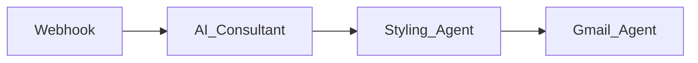

***

# AI Automation Society – Automated AI Implementation Reports with n8n & Base44

Automate AI consulting reports: collect requests from the AI Automation Society website, analyze business problems with LLM agents, generate client-ready HTML reports, and deliver them over email—all using n8n and Base44.

***

## Project Overview

This project provides an end-to-end automated system for generating personalized AI implementation guides. When a business fills out the form on the AI Automation Society website, the workflow uses a webhook to capture details, processes them with two chained AI Agents, creates a styled HTML report, and sends it directly to the prospect by email. Each report includes an invitation to book a personal strategy call.

***

## Workflow Architecture

Or, illustrate visually:

 receives the data and drafts a solution proposal.
- **Styling Agent** formats the generated solution into a polished HTML document.
- **Gmail Agent** emails the HTML report as a free guide.
- The report **concludes** with a “Book a Call” invitation using your Calendly link.

### Sample Report Output

***

## Features

- **No-code to Pro-code Workflow:** Set up everything in n8n with easy extensibility.
- **Multi-agent Orchestration:** Combine prompt-based logic and HTML post-processing.
- **Automated Email Delivery:** Integrates directly with Gmail for instant client followup.
- **Actionable Call-To-Action:** Each report ends with a Calendly link for easy consultation booking.

***

## How to Use

1. Clone this repo and import the workflow JSON into your n8n instance.
2. Configure environment variables (API keys for LLMs, your Gmail, webhook URL, Calendly link).
3. Deploy the intake form/website via Base44 or another platform.

***

## Book a Call

Each delivered report closes with this call to action:
> Ready to automate your business? [Book a free strategy call](YOUR_CALENDLY_LINK) with us.

***

## License

MIT

***

Replace `YOUR_CALENDLY_LINK` with your actual link. Adjust image file paths if you place them in a subfolder. This README template follows good open-source documentation practice and will help others understand, use, and contribute to your project.
